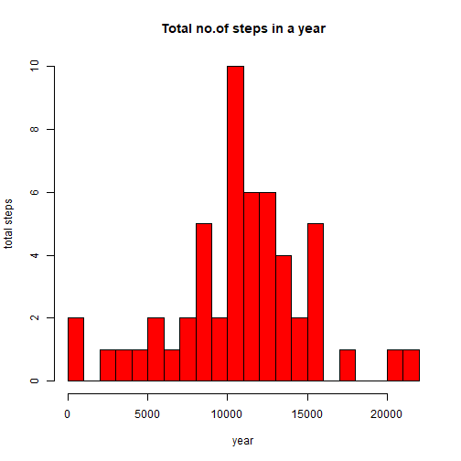
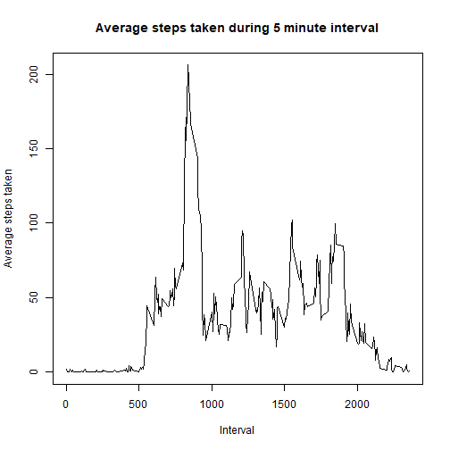
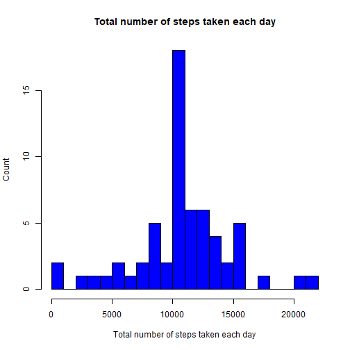
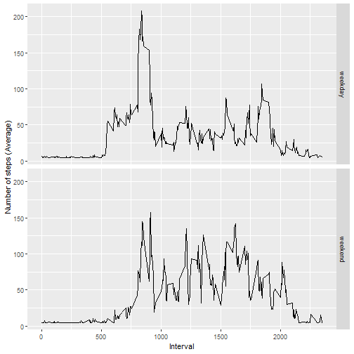

## Loading and preprocessing the data

### 1. Load the data (i.e. read.csv())


```r
activity <- read.csv('activity.csv')

head(activity)
```

```
##   steps       date interval
## 1    NA 2012-10-01        0
## 2    NA 2012-10-01        5
## 3    NA 2012-10-01       10
## 4    NA 2012-10-01       15
## 5    NA 2012-10-01       20
## 6    NA 2012-10-01       25
```

### 2. Process/transform the data into a format suitable for your data analysis i.e converting string date character into date


```r
activity$date <- as.Date(activity$date,format="%Y-%m-%d")
head(activity)
```

```
##   steps       date interval
## 1    NA 2012-10-01        0
## 2    NA 2012-10-01        5
## 3    NA 2012-10-01       10
## 4    NA 2012-10-01       15
## 5    NA 2012-10-01       20
## 6    NA 2012-10-01       25
```
## What is mean total number of steps taken per day?

### 1.Total no.steps taken per day


```r
library(dplyr)

total_steps_data <- activity %>%na.omit() %>% group_by(date) %>% summarize(total_steps=sum(steps))
head(total_steps_data)
```

```
## # A tibble: 6 × 2
##   date       total_steps
##   <date>           <int>
## 1 2012-10-02         126
## 2 2012-10-03       11352
## 3 2012-10-04       12116
## 4 2012-10-05       13294
## 5 2012-10-06       15420
## 6 2012-10-07       11015
```
### 2. Histogram for total number steps taken per day

```r
with(total_steps_data,hist(total_steps,breaks=20,xlab='year',ylab='total steps',main="Total no.of steps in a year",col='red'))
```




```r
meansteps <- round(mean(total_steps_data$total_steps))
mediansteps <- round(median(total_steps_data$total_steps))
```
The mean and median of the total number of steps in a year 1.0766 &times; 10<sup>4</sup> and 1.0765 &times; 10<sup>4</sup>

## What is the average daily activity pattern?

### 1. Calculating the average number of steps/5 minute interval

```r
avg_steps_data <- activity %>% na.omit() %>% group_by(interval) %>% summarize(avg_steps=mean(steps))
```
### 2. Plotting a histogram for average steps for 5 minute interval


```r
with (avg_steps_data, plot(interval,avg_steps,type="l",xlab="Interval",ylab="Average steps taken",main="Average steps taken during 5 minute interval"))
```



### 3. Finding the 5 minute interval which has max no. of steps


```r
intervalWithMaxSteps <- avg_steps_data$interval[which.max(avg_steps_data$avg_steps)]
intervalWithMaxSteps
```

```
## [1] 835
```

## Imputing missing values

### 1. Calculate and report the total number of missing values in the dataset


```r
missing_values <- colSums(is.na(activity))
missing_values
```

```
##    steps     date interval 
##     2304        0        0
```
### 2. Fixing the missing values by mean of steps

```r
imputed_data <- activity
imputed_data$steps[is.na(imputed_data$steps)] <-  mean(imputed_data$steps,na.rm=T)
missing_values <- colSums(is.na(imputed_data))
missing_values
```

```
##    steps     date interval 
##        0        0        0
```

```r
imputed_data$date <- as.Date(imputed_data$date,format="%Y-%m-%d")
head(imputed_data)
```

```
##     steps       date interval
## 1 37.3826 2012-10-01        0
## 2 37.3826 2012-10-01        5
## 3 37.3826 2012-10-01       10
## 4 37.3826 2012-10-01       15
## 5 37.3826 2012-10-01       20
## 6 37.3826 2012-10-01       25
```


```r
total_steps_imputed <- imputed_data %>% group_by(date) %>% summarize(total_steps_imp=sum(steps))
with(total_steps_imputed,hist(total_steps_imp,breaks=20,xlab="Total number of steps taken each day",ylab="Count",main="Total number of steps taken each day",col="blue"))
```



```r
imputed_meansteps <- round(mean(total_steps_imputed$total_steps_imp))
imputed_mediansteps <- round(median(total_steps_imputed$total_steps_imp))
imputed_meansteps
```

```
## [1] 10766
```

```r
imputed_mediansteps
```

```
## [1] 10766
```
### Inference:
#### The difference between means for raw data and imputed data is 0.

#### The difference between medians for raw data and imputed data is 1.

#### By imputing the 'NA' values with mean of steps in the raw data ,  the mean remained the same but the median has changed marginally by 1 and moved closer to the mean of the raw data.

# Are there differences in activity patterns between weekdays and weekends?

## 1.Create a new factor variable in the dataset with two levels – “weekday” and “weekend” indicating whether a given date is a weekday or weekend day.

```r
imputed_data$day <- weekdays(imputed_data$date)

imputed_data$dayType <- "weekday"

imputed_data$dayType[imputed_data$day %in% c("Saturday","Sunday")] <- "weekend"
```


```r
weekData <- imputed_data %>% group_by(dayType,interval) %>% summarize(avg_day_steps=mean(steps))
```

```
## `summarise()` has grouped output by 'dayType'. You can override using the `.groups` argument.
```
## 2. Make a panel plot containing a time series plot for 5-minute interval (x-axis) and the average number of steps taken


```r
library(ggplot2)

qplot(interval,avg_day_steps,data=weekData, geom="line",xlab="Interval",ylab="Number of steps (Average)", facets=dayType ~ .)
```



### Inference : The average steps is more in the weekdays as per the plot which may be related to people working in weekdays.
